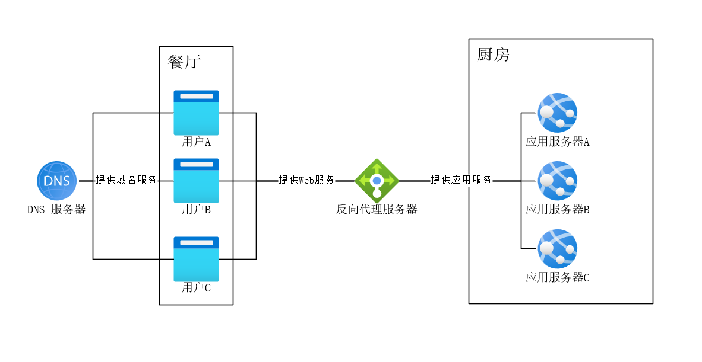
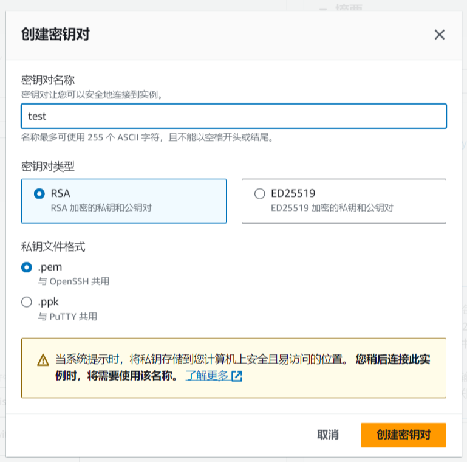
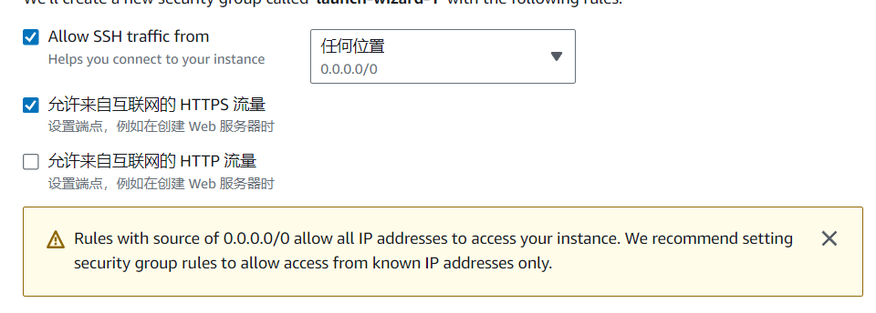
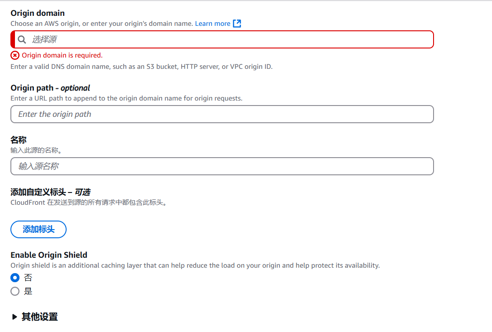

# 引言

其实就是我需要更新了，又正好有这么一个热点事件，所以写了本文

# 什么是 DDoS

## 谈谈现代网站服务模型

首先，我们得知道一个一个现代网站的最简服务模型：

- N个用户
- N个反向代理服务器
- N个 DNS 服务器
- N个应用服务器

我们把他们比喻为一个餐厅，那就是：

- N个客人，负责消费
- N个服务员，负责点菜、倒水和端菜
- N个导航软件，负责指引客人餐厅位置
- N个厨师，负责制作菜品

如下图：

## 都有哪些DDoS类攻击

现在我们要探讨另一个问题——如何以最低的成本让这个餐厅无法做生意，很显然的，有几种思路：

1. 让这个餐厅没客人（攻击方法很多且超出本人领域，这里不做说明）
2. 让服务员无法正常工作（DDoS/DoS攻击/慢速CC攻击等）
3. 让导航软件无法正常工作（DNS 攻击 / DNS 污染）
4. 让厨师无法正常工作（CC攻击/漏洞攻击/SQL注入等）

### DDoS 攻击

DDoS的原理就是让“服务员”疲于响应，例如雇佣100个流浪汉进入餐厅，进来之后只翻菜单并在5分钟后叫服务员要一杯水，然后离开，然后再进去，这个方法在于：

1. 成本极低。雇佣“流浪汉”的成本相当低廉
2. 解决难度高。因为服务员无法确定这个人究竟是不是要点菜，只能进行响应
3. 难以拦截。你需要把全部流浪汉都标记一遍才能完全拦截，而且对方可以雇佣新的

这就是 DDoS 攻击，通过大量肉鸡或僵尸网络（即流浪汉）来对目标网站发出无效数据包，经DNS解析（即前台）指引后由反向代理服务器（即服务员）进行回应，通过无止境的无效数据包来让反向代理服务器疲于回应并瘫痪，我们也不难发现 DDoS 攻击的几个特征：

1. 攻击并不是真正的请求，只是无效数据包。“点菜”这一操作从未被进行，服务员只是在回应“要一杯水”这个无效数据包
2. 应用服务器不会被攻击。没点菜自然没有厨师什么事（仅针对传统DDoS攻击，现代应用层DDoS（如HTTP Flood）可能直接冲击应用服务器）
3. DNS 服务器在这里不是重点攻击对象。虽然DNS服务器本身也可能成为攻击目标，但在这里我们暂且按下不表
4. 攻击发起者数量庞大。“雇佣”成本低廉

这就是 DDoS 攻击

### DDoS 放大攻击（反射攻击）

DDoS反射攻击通过诱使第三方服务器响应请求来掩盖攻击源，其中若响应数据大于查询数据（如DNS/NTP协议），则称为放大攻击，能实现流量倍增效果。

DDoS放大攻击就是利用公网其他服务器的漏洞来实现“四两拨千斤”的效果，例如伪装为餐厅老板，发布一些不实的优惠信息，这样就会有大量的人进入餐厅，而你连“雇佣”他们都不需要。

这样的优势也很显然：

1. 成本更加低廉
2. 源头难以查找
3. 更难以屏蔽

例如 Memcached 反射攻击可将1GB请求流量放大为最高5万倍的攻击流量，而 NTP 反射攻击也能达到约556倍的放大效果。

### CC攻击

CC攻击侧重点有一点区别：

- 慢速攻击通过极慢速发送HTTP请求头（例如每10秒发送一个字节），保持大量连接长时间占用服务器资源，使其无法处理正常请求。
- 普通CC攻击是通过制造难以处理的请求来让应用服务器无法回复正常用户的请求，从而让正常客户无法得到预期请求

换而言之：
DDoS的目的是让你无法进入“餐厅”，而CC攻击是让你在“餐厅”里也没有“菜”

CC攻击的危险在于：

1. 攻击者就是正常客户。在一个请求真正地达到消耗资源目的前极难识别
2. 并非急性进行。CC攻击很多时候的目的并不是“打垮”而是“打残”，让网站长期高负荷而非短期瘫痪
3. 成本更低。对于LLM类应用而言，如果缺少对回复长度的适当限制，很容易就能构造CC攻击请求。

## 如何防御

### DDoS类攻击

答案是没有什么防御方法，现有DDoS类攻击防御方法基本都是硬抗——利用网络资源尽可能多地消化掉DDoS攻击流量，但是消化的方法有很多。

我们大致将其分为三类，清洗、消化和缓解：

- 清洗的目的是让恶意流量到不了服务器
- 消化的目的是让恶意流量打不死服务器
- 缓解的目的是让恶意流量达不到攻击目的

#### 清洗

通过技术手段在攻击流量抵达目标服务器前进行识别和拦截：

- 流量特征识别：基于IP信誉库、协议异常检测（如畸形包过滤）、行为模式分析（突发流量阈值）过滤恶意流量。

- 分布式清洗节点：利用CDN或Anycast网络将流量分散至全球节点，就近清洗后再回源。

- BGP引流：通过边界网关协议将流量导向第三方清洗中心（如运营商提供的DDoS防护服务）。

- 黑名单/IP限速：实时封禁高频攻击源IP，或对特定IP段进行请求速率限制。

绝大多数SaSS DDoS防御服务采取的方式，例如Cloudflare和AWS Shield。核心在于在服务器之外把 DDoS 消化掉，并识别出合法流量转发给服务器。

#### 消化

提升系统承载能力，确保关键服务在攻击中存活：

- 带宽冗余：预留超出日常流量数倍的带宽资源以吸收攻击流量。

- 弹性云架构：通过云服务自动扩展计算资源（如AWS Auto Scaling），动态应对流量峰值。

- 协议栈优化：调整TCP/IP协议参数（如SYN Cookie）、使用QUIC协议降低连接开销。

洪水来了拓宽河道，成本最高，最简单直接，最有效。但是成本多数情况下是远高于损失本身的，所以这个方法用的并不多

#### 缓解

削弱攻击对业务的影响，迫使攻击者放弃：

- 人机验证机制：对异常流量触发验证码或JavaScript质询，过滤自动化攻击。

- 动态资源调度：遭遇攻击时自动降级非核心功能，释放资源保障主服务。

- 虚假响应诱导：向攻击源返回伪造的服务响应数据，消耗攻击者资源。

其实这个步骤很多人都做过：在nginx中拉黑某ip时返回500/502/503而不是403来迷惑攻击者，这就可以说是典型的“缓解”方式

## 防御服务

那么，有没有防御 DDoS 的服务呢。当然是有的，在这里介绍一下亚马逊的EC2服务，自带 AWS Shield Standard 缓解 DDoS，现在注册[亚马逊云科技](https://aws.amazon.com/cn/free/?trk=058b7d13-d9a8-454a-9afe-9c5938e30f99&sc_channel=sm)账户可以享受[12个月免费套餐](https://aws.amazon.com/cn/free/?trk=058b7d13-d9a8-454a-9afe-9c5938e30f99&sc_channel=sm)，其中包括 Amazon EC2 云服务器、S3 云储存、Cloudfront CDN等多种热门产品。
为节省时间，此处省略注册账号的过程，仅保留新建实例的过程:
首先在控制台点击启动实例:

随后输入相关内容，实例选择`t2.micro`，系统选择`ubuntu 24.04LTS`，随后创建密钥对：

根据需求选择，一般建议使用pem格式，提前选择放行HTTPS端口，节省时间:

一切完成之后，启动实例，等待创建完成后使用SSH连接到终端即可。
另外建议开启IPV6，操作如下：
进入此 EC2 对应的VPC，选择`编辑CIDR`，随后添加新的IPV6 CIDR块，选择`Amazon 提供的 IPv6 CIDR 块`，随后返回。

进入此 EC2 对应的子网，右键`编辑 IPV6 CIDR`，添加即可。
然后进入路由表，为`::/0`添加一条和`0.0.0.0/0`一致的路由。
随后进入`EC2 设置`，联网->管理IP设置，分配新的IPV6地址。
现在，这台EC2实例已经支持IPV6了。

对于使用其他服务器的情况，也可以用cloudfront来提高网站访问速度并享受到 AWS Shield Standard 服务:

- Origin domain即为回源地址，建议在源服务器上配置HTTPS来保证回源安全性
- Origin path即为回源路径，假如网站不在`/`下需配置本项
- Origin Shield类似于L1-L2分层缓存，可以降低源服务器请求数和负荷，配置时建议将地区配置的离服务器尽可能近

下方配置按照自己网站实际即可，建议配置：

- 自动压缩对象选 Yes
- 查看器协议策略选 Redirect HTTP to HTTPS
- 支持的 HTTP 版本选 HTTP/2 和 HTTP/3
- IPv6 选 Yes

随后，你的网站就接入了 cloudfront，获得了cloudfront的加速和保护

[AWS中国官网](https://www.amazonaws.cn/)
