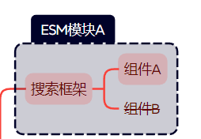
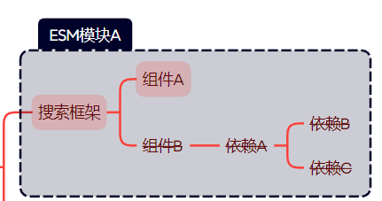
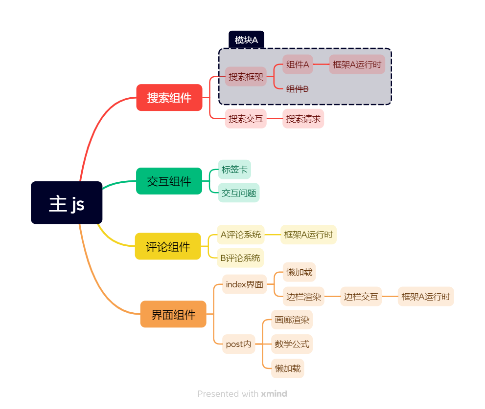
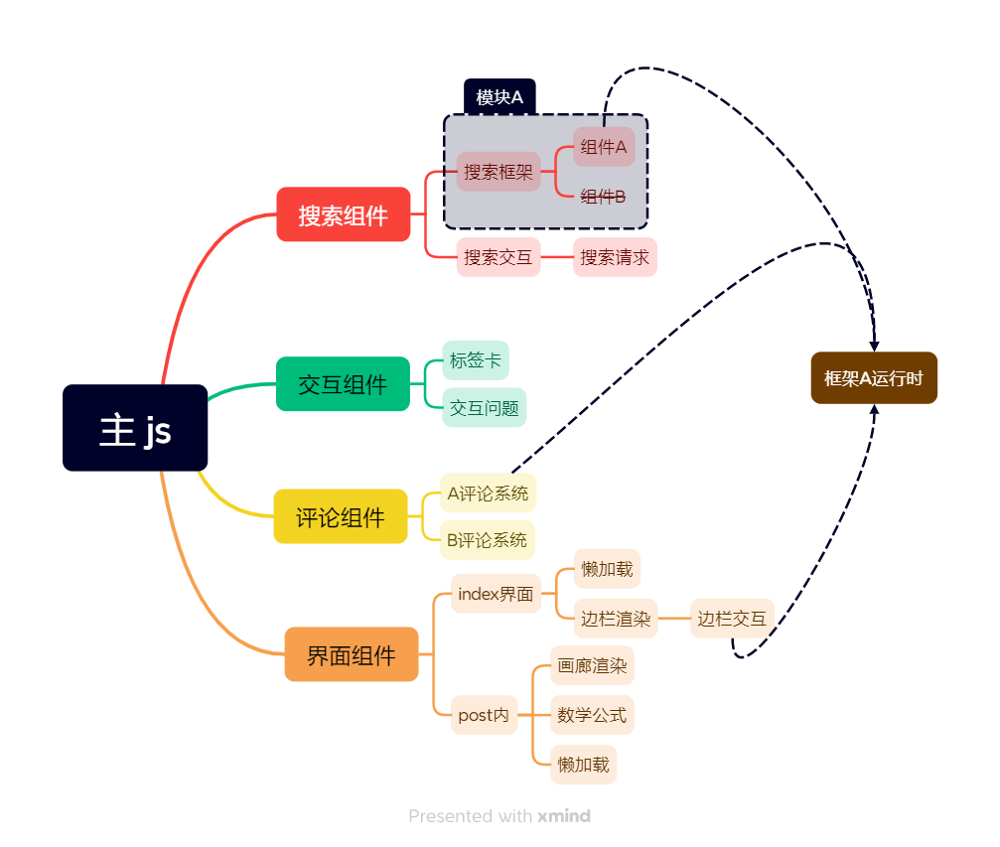

---
categories:
  - 网站建设
  - hexo
date: 2024-02-09 20:38:35
tags:
  - 现代化前端技术
  - hexo
  - shokaX
title: 论 ESM 和 esbuild 在 hexo 主题中的应用
---

# 论 ESM 和 esbuild 在 hexo 主题中的应用

## 引言

本文为 [ShokaX](https://github.com/theme-shoka-x/hexo-theme-shokaX) 0.4 中采用的新技术，使用 ESM + esbuild 实现 js 打包 tree-shaking
和 js 模块化

我们在 ShokaX 0.3.15 和 ShokaX 0.4alpha4 上分别进行测试，得到如下结论：

| 测试版本  |      采用技术      | 落地页 js 体积 | 完整 js 体积 |
| :-------: | :----------------: | :------------: | :----------: |
|  0.3.15   | CJS(UMD) + esbuild |    561.2KB     |   561.2KB    |
| 0.4alpha4 |   ESM + esbuild    |     43.2KB     |    283 KB    |

注：上述 js 体积为主题生成 js + 所有第三方在主 js 执行前的 js 体积之和

我们在采用 ESM + esbuild 后总js体积达优化前的 50%，在落地页js体积可达优化前的 **7%**，并且用户侧实际执行的 js 远小于此
但是为什么这两个技术能有如此大的作用呢

## 为什么是 ESM

这个问题的答案随便一搜都能搜出来：ESM 模块具有静态结构，ESM 具有更好的 tree-shaking 能力
所以 ESM 为什么相较于 UMD 有如此大的进步也很显然，很多人都用“摇动死去的叶子”作为例子（实际上 tree-shaking 确实是这个意思）
但我更喜欢用“树”本身来描述这件事：

这是一个类hexo主题的功能分解，本例中ESM的好处：

### tree-shaking

例如搜索模块，包含组件A、B，假如我们只需要组件A，此时直接使用UMD模块就会浪费组件B的带宽，这是因为两点：

1. 大部分UMD模块是预构建的，通过公共CDN进行分发，这意味着为了保证功能完整，只能打包最大功能集的UMD文件（部分库会提供不同配置的UMD，但治标不治本）
2. UMD是动态的，且相当部分的UMD模块采用对外暴露变量的方法，这高度不利于tree-shaking

但是假如我们使用ESM版本的搜索模块：

现在组件B被划去了，在最终js中**不包含**组件B，假如组件B有其他依赖：

那么此时组件B及其依赖都会被切断，这也是为什么我更喜欢用“树”表示这一过程的原因，“叶子”给人一种暗示就是“此组件即为依赖链末端”，忽略了 ESM tree-shaking 时能切断依赖链的这一特性

此步骤通常可以减少5-10%的 js 体积，取决于原先UMD模块的大小

### 代码重用

还是这棵树，但是做了些许改动：

我们可以看到里面有三个框架A的运行时，假如这是一个相对较大的框架，重复加载3个运行时绝非一件易事

因为UMD本身的特性，这些运行时如果不刻意提取是无法共用的，而绝大多数UMD为了保证开箱即用都会把框架运行时打包

但是假如是ESM：

在打包时，打包器会发现多个模块引用了同一个框架（因为ESM的静态特性），此时打包器就会仅打包一次框架A，而不是像UMD一样分别捆绑（前提是依赖不冲突）

注：上图中的懒加载先留着，后面有用

此类情况并不常见（但假如你在一个基于Vue的主题中使用waline就会遇到）一旦遇到，此类优化通常能减少15-35%的js体积

### 功能开关

上图中的功能，如果用户不想使用，则需要关闭
此时UMD和ESM的区别不太明显，因为UMD可以通过关闭模板的script标签实现不引入
因而不做详细讲解，后文 esbuild 部分会有实现说明

### 懒执行

这个技术和懒加载很类似，有些功能非常重，但是不太重要（例如搜索和评论系统）
为了减少js运行时间和网络负载，可以采用懒执行技术。

主要实现方法为动态导入（即`import()`）配合 esbuild esm 格式的代码拆分功能，通过 IntersectionObserver 或者点击事件等方法在使用时再导入js

其实 UMD 也可通过动态加载script标签实现类似效果，但是可控性和性能都相对更差

此方法可有效优化落地页js体积和执行时间

## 具体实现

### 模块化

首先，主题的js需要实现基于 ESM 的模块化（Typescript 更好）

这部分不做详细解释，建议自行寻找 ESM 教程

### 引入 esbuild

第一步，把主题js放在一个以`_`开头的文件夹中，因为未经打包的js/ts是不应被生成的，需要忽略

然后，在你的主题scripts生成器中添加一个生成器，使用 esbuild 编译相关 js，例如：

```typescript
import { buildSync } from "esbuild";

buildSync({
  entryPoints: ["_app/entry.ts"],
  bundle: true,
  outdir: "themeTemp",
  tsconfigRaw: {
    compilerOptions: {
      target: "ES2022",
      esModuleInterop: true,
      module: "ESNext",
      moduleResolution: "Node",
      skipLibCheck: true,
    },
  },
  platform: "browser",
  format: "esm",
  target: ["es2022"],
  minify: true,
  legalComments: "linked",
  mainFields: ["module", "browser", "main"],
  splitting: true,
});
```

参数的详细解释如下：

- entryPoints: 主题 js 入口点，以 hexo 根目录（即hexo-site pkg所在）为基准
- bundle: 显式捆绑所有依赖项，为了在浏览器端运行，必须这么配置
- outdir: 输出目录，目录以hexo根目录为基准。在使用完成后请注意删除此文件夹以节省用户磁盘空间
- tsconfigRaw: 如果主题使用 ts，此选项为 tsconfig.json 内容
- platform: 编译目标平台，一般使用`browser`
- format: 必须为 esm，否则代码拆分不可用
- target: 编译目标，建议查看 [esbuild 文档](https://esbuild.github.io/api/#target) 以获取详细信息
- minify: 压缩生成 js，建议启用
- legalComments: 版权声明储存位置
- mainFields: 默认使用package.json中的哪个入口点，建议和示例一致而非保持默认，因为：
  - 大部分包的browser入口点为 UMD 包而非 ESM 包，这不利于 tree-shaking
  - 通常 main 为 CJS，和 browser 在打包方面表现类似，但 browser 可能兼容性更好（CJS 是 node 格式）
- splitting: 显式启用代码拆分，如果需要懒执行特性必须开启

然后，出于兼容性目的渲染 js 并传入生成器即可

### 在模板中引入和预加载

引入只需要注意script需要带`type=module`，建议配合`defer`或者`async`

预加载指在html head解析时就提前要求浏览器下载 ESM 模块，这可以解决依赖链所带来的加载缓慢问题，例如一条依赖链：

```text
app.js
  |- chunk-AAAA.js
    |- search-AAAA.js
  |- chunk-BBBB.js
```

此时，如果不采用预加载，search 需要`app.js`和`chunk-AAAA.js`解析完毕后才会开始引入，假如search此时需要被调用时会有明显延迟
预加载需要在模板头部加入带有`modulepreload`的`link`，这会让浏览器提前下载并解析模块，这是一个示例`helper`：

```typescript
hexo.extend.helper.register("preloadjs", function () {
  const { statics, js } = hexo.theme.config;
  let res = "";
  fs.readdirSync("./themeTemp").forEach((file) => {
    if (file.endsWith(".js")) {
      res += htmlTag(
        "link",
        { rel: "modulepreload", href: url_for.call(this, `${statics}${js}/${file}`) },
        "",
      );
    }
  });
  return res;
});
```

此时调用就会生成一段模块预加载html，注意放在head内

### 定义静态常量

esbuild 的选项中 define 一下即可，例如：

```typescript
define: {
  __shokax_search__: config?.algolia ? "true" : "false";
}
```

此时在代码中使用：

```typescript
if (__shokax_search) {
  // ...
}
```

即可在编译时 tree-shaking 掉无用代码
:::info
务必注意 esbuild 时哪些变量可访问，否则可能错误/无效 tree-shaking
:::

### 懒执行

使用动态 import 导入非必要代码，例如：

```typescript
if (__shokax_waline__) {
  import("../components/comments").then(({ walinePageview, walineComment }) => {
    walinePageview();
    walineComment();
  });
}
```

此时这段代码只是被异步执行了，不会懒执行，我们可以添加一个 `IntersectionObserver`，当评论正上方的 `#copyright` 可见时开始加载评论：

```typescript
const comment = new IntersectionObserver(
  (entries) => {
    entries.forEach((entry) => {
      if (entry.isIntersecting) {
        if (__shokax_waline__) {
          import("../components/comments").then(({ walinePageview, walineComment }) => {
            walinePageview();
            walineComment();
          });
        }
        comment.disconnect();
      }
    });
  },
  {
    root: null,
    threshold: 0.2,
  },
);

comment.observe($dom("#copyright"));
```

此时 comment 就已经被懒运行了

## 结语

本文事实上是 hexo 对于 ESM + esbuild 的补丁，现代的内容中心生成器早已实现（Astro、Vitepress、Valaxy等）

如果您已经看到了这里，相信您对于前端现代化技术相当重视，那么让我们来看一下 hexo 主题的普遍现状：

- 前端自动化？Gulp 压缩静态文件都可以叫自动化，CI 工作流闻所未闻
- 代码模块化？script 标签分别引入都可以叫模块化，ESM 和 esbuild 闻所未闻（注：本文可能是第一个在 hexo 框架下涉及此方面的）
- css 模块化？按需引入根本没有，整体思想仍然停留在数年前的一个 css 解决所有问题
- 现代 UI 架构？没有 ESM 的情况下使用 UMD 引入各个 UI 架构绝非一件易事（指开发体验）
- 热重载、SPA、SSR？这些连补丁都打不了

所以说在 2024 年开发一个 100% 的 hexo 主题真的是一个好选择吗？我认为不是 \
如果您准备开发一个新主题，我更建议您使用 [Astro](https://astro.build)、[Valaxy](https://valaxy.site)等现代 Blog 框架，
或者将 hexo 作为 CMS，使用 Next.js、Nuxt.js 等框架渲染实际内容。开发一个 100 % 的 hexo 主题所带来的缺点愈发明显，不限于上面的 5 点，
今天有人为 hexo 打 ESM 的补丁，出现下一个问题还会有下一个吗？或者说，补丁还打的过来吗？

如果您对本文章有任何疑问，欢迎给我发邮件或者去 ShokaX 的讨论区询问。
