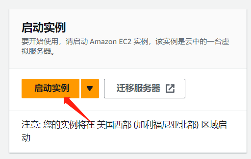
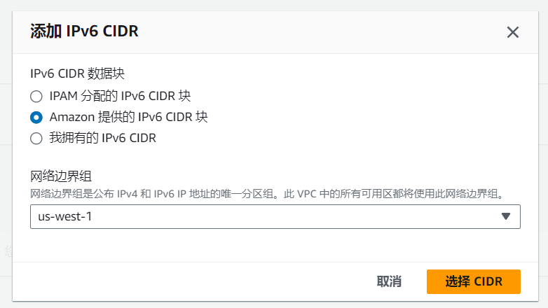
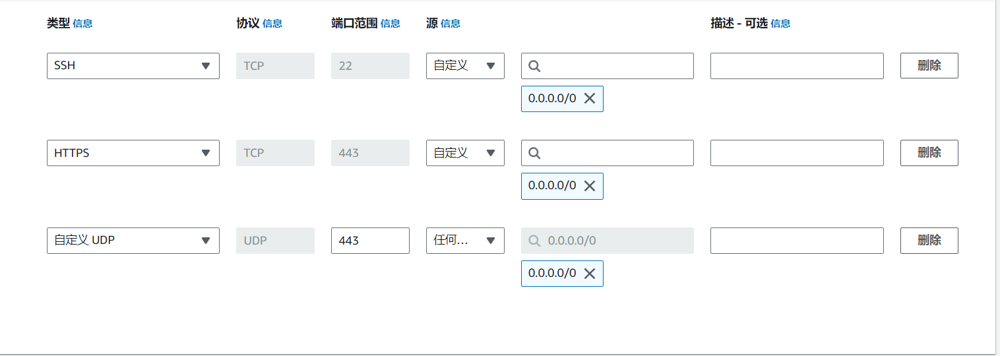

---
categories:
  - 网站建设
date: 2023-11-3 21:42:37
keywords: http/3,quic,nginx-quic,nginx,boringssl
tags:
  - nginx
  - quic
title: 使用nginx 1.25开启 HTTP/3 支持
---

# nginx 与 HTTP/3

## 开始之前

这是本站第三篇关于 HTTP/3 (或者说 QUIC)的文章，从 caddy 到 nginx-quic 再到现在的 nginx 1.25，它终于正式支持了HTTP/3协议。

当然，openssl还不支持且2024年前完成 QUIC 支持希望渺茫，因此本文使用`boringssl`代替openssl。`quictls`和`libressl`同样可以完成此工作，未来可能会提供相关教程（挖坑）

本文带有一定的广告内容，如果无法接受，您可以点击左侧的目录跳过相关部分。

## 为什么选择 HTTP/3

这里有一个可能不太恰当的比喻:

一天中午，你选择到 HTTP 街用餐，在你面前有两家餐厅：HTTP/2 和 HTTP/3 餐厅。

第一天你选择了 HTTP/2 餐厅进入，你点了许多美食和一个三明治。HTTP/2 餐厅的后厨可以同时制作多道菜，因此你认为你很快就能吃到美食。然后 HTTP/2 餐厅的
服务员告诉你：“三明治出了点问题，后厨没法上菜。”然后就出现了一个问题，根据 HTTP/2 餐厅的规则，在这道菜上菜之前，后面的菜不能上菜，即使它已经被制作好了。
你花了很多时间来和服务员沟通，以确定“三明治是不是真的出问题了”和“下一道菜什么时候上”。但这个三明治阻塞住了整个队列，因此你只能等后厨花费一段时间来处理三明治问题。

第二天你选择了 HTTP/3 餐厅，在这里，你只需要扫描准备好的二维码，然后点菜，随后等待菜品即可。和昨天一样，三明治再次堵塞了队列，但是这次 HTTP/3 餐厅可以选择不按顺序上菜。
后厨很快就准备好了其他菜品，因此你并没有等待多久，而且消息已经被发送到了你的手机上，你并不需要和服务员花费时间沟通。

在上述例子中，“三明治”代表了一个传输失败的数据包，而HTTP2虽然可以进行多路复用(即同时制作多道菜品)，但如果数据包出现问题，仍可能阻塞整个队列。并且TCP的握手流程相当繁琐，
需要花费很多时间来解决重发问题。而HTTP3则可以选择先发送什么后发送什么，即使“三明治”出了问题，也不会导致队列被整体阻塞，而且UDP在此方面效率较高，至少比HTTP2餐厅的服务员们要高多了。

+++info 一个更细致的解释
这个比喻用一个生动的场景来解释了HTTP/2和HTTP/3之间的主要区别。HTTP/2和HTTP/3都是基于TCP和UDP的协议，它们用于在网络上传输数据。HTTP/2使用TCP，而HTTP/3使用UDP。TCP和UDP的区别在于，TCP是一种可靠的协议，它保证了数据包的有序和完整的到达，但是如果数据包丢失或损坏，它会导致传输的延迟和阻塞。UDP是一种不可靠的协议，它不保证数据包的有序和完整的到达，但是它可以更快地传输数据，而且不会因为数据包的丢失或损坏而阻塞整个流。

因此，HTTP/2餐厅的规则类似于TCP的机制，它要求所有的菜品按照点菜的顺序上桌，如果有任何一道菜出了问题，就会影响后面的菜品，即使它们已经准备好了。这就是所谓的**头部阻塞**，它会降低传输的效率和用户的体验。HTTP/3餐厅的规则类似于UDP的机制，它允许菜品按照任意的顺序上桌，如果有任何一道菜出了问题，也不会影响其他的菜品，它们可以继续被送到客人的手中。这就是所谓的**无头部阻塞**，它会提高传输的效率和用户的体验。

这个比喻也展示了HTTP/2和HTTP/3的另一个区别，就是**多路复用**和**多流**的概念。多路复用是指在一个TCP连接上同时传输多个请求和响应，而多流是指在一个UDP连接上同时传输多个独立的数据流。HTTP/2使用多路复用，而HTTP/3使用多流。多路复用和多流的区别在于，多路复用是在一个连接上共享资源，而多流是在一个连接上分配资源。多路复用的优点是可以减少连接的数量和开销，但是缺点是如果一个请求或响应出了问题，就会影响整个连接上的其他请求或响应。多流的优点是可以隔离不同的数据流，使它们互不干扰，但是缺点是需要更多的连接和开销。

因此，HTTP/2餐厅的后厨类似于多路复用的机制，它可以同时制作多道菜，但是如果有一道菜出了问题，就会影响其他的菜。HTTP/3餐厅的二维码类似于多流的机制，它可以同时传输多个数据流，但是如果有一个数据流出了问题，也不会影响其他的数据流。

注: 可能存在问题，因为字数太多懒得看第二遍（逃
+++

## 使用Nginx-quic

### 前提条件

本教程需要一个基于 ubuntu 22.04(可以更高)的服务器，并需要宝塔面板。如果你还没有的话，AWS 的 EC2 就是一个好选择：
现在注册[亚马逊云科技](https://www.amazonaws.cn/?sc_channel=seo&sc_campaign=blog921)账户可以享受[12个月免费套餐](https://aws.amazon.com/cn/free/)，其中包括 Amazon EC2 云服务器、S3 云储存、Cloudfront CDN等多种热门产品。
为节省时间，此处省略注册账号的过程，仅保留新建实例的过程:
首先在控制台点击启动实例:

随后输入相关内容，实例选择`t2.micro`，系统选择`ubuntu 22.04LTS`，随后创建密钥对：

根据需求选择，一般建议使用pem格式，提前选择放行HTTPS端口，节省时间:

一切完成之后，启动实例，等待创建完成后使用SSH连接到终端即可。
另外建议开启IPV6，操作如下：
进入此 EC2 对应的VPC，选择`编辑CIDR`，随后添加新的IPV6 CIDR块，选择`Amazon 提供的 IPv6 CIDR 块`，随后返回。

进入此 EC2 对应的子网，右键`编辑 IPV6 CIDR`，添加即可。
然后进入路由表，为`::/0`添加一条和`0.0.0.0/0`一致的路由。
随后进入`EC2 设置`，联网->管理IP设置，分配新的IPV6地址。
现在，这台EC2实例已经支持IPV6了。

下文均可在此 EC2 实例的 SSH 终端内进行。
本文全程基于root权限进行。

### 安装依赖

在终端运行如下指令:

```shell
apt install build-essential ca-certificates zlib1g-dev libpcre3 libpcre3-dev tar unzip libssl-dev wget curl git cmake ninja-build golang
# 需要启用源代码软件源(deb-src)
apt-get build-dep nginx
```

### 编译ssl库

#### 编译boringssl

:::info
下列指令需要gcc支持C++14或更高标准,建议升级为gcc9以上版本
:::

```shell
git clone --depth=1 https://github.com/google/boringssl.git
# github速度问题自行解决
cd boringssl
mkdir build
cd build
cmake -GNinja ..
ninja
cd ../..
```

如果出现了网络问题,执行如下命令:

```shell
go env -w GOPROXY=https://goproxy.cn,direct
```

### 安装nginx-brotli(可选)

brotli 是一种由google 提供的新型压缩方式，比传统的gzip在体积方面要小很多[^1] \
安装步骤如下，为保证路径合理，在`/www/server`下进行:

```shell
cd /www/server
git clone https://github.com/google/ngx_brotli.git
cd ngx_brotli
# vim .gitmodules
# git submodule sync
git submodule update --init
```

如果 clone 时使用了 github 加速，请解除第4行注释并修改此文件内的 url 为加速后链接，随后执行第5行后再进行下一步。

### 获取和配置 nginx

截止本文写就时，Nginx 最新版为 1.25.3，因此下列链接使用此版本:

```shell
wget https://nginx.org/download/nginx-1.25.3.tar.gz
tar -xzvf nginx-1.25.3.tar.gz
```

随后运行:

```shell
nginx -V
```

输出内容应该类似于:

```text
nginx version: nginx/1.25.3
built by gcc 11.4.0 (Ubuntu 11.4.0-1ubuntu1~22.04)
built with OpenSSL 1.1.1q
TLS SNI support enabled
configure arguments: --user=www --group=www --prefix=/www/server/nginx --add-module=/www/server/nginx/src/ngx_devel_kit --add-module=/www/server/nginx/src/lua_nginx_module --add-module=/www/server/nginx/src/ngx_cache_purge --with-pcre=pcre-8.43 --with-http_v2_module --with-stream --with-stream_ssl_module --with-stream_ssl_preread_module --with-http_stub_status_module --with-http_ssl_module --with-http_image_filter_module --with-http_gzip_static_module --with-http_gunzip_module --with-ipv6 --with-http_sub_module --with-http_flv_module --with-http_addition_module --with-http_realip_module --with-http_mp4_module --add-module=/www/server/nginx/src/ngx_http_substitutions_filter_module-master --with-ld-opt=-Wl,-E --with-cc-opt=-Wno-error --with-ld-opt=-ljemalloc --with-http_dav_module --add-module=/www/server/nginx/src/nginx-dav-ext-module --with-openssl=/www/server/nginx/src/openssl
```

此时，删除`--with-openssl=...`，并添加`--with-http_v3_module`和`--with-cc-opt=-I../boringssl/include --with-ld-opt='-L../boringssl/build/ssl -L../boringssl/build/crypto'`
修改`--with-pcre=pcre-8.43`为`--with-pcre=/www/server/nginx/src/pcre-8.43`
:::warning
注意boringssl路径，编译参数和`nginx-quic`有不同，请勿直接沿用
:::
如果你在上文中配置了brotli，再添加`--add-module=/www/server/ngx_brotli`在尾部 \
现版本 OSCP 装订已可正常使用，无需注释相关配置

### 编译 nginx

:::info
部分环境编译时可能出现警告，如果出现了建议检查 Boringssl 路径和依赖。 \
均确认无误请修改`objs/Makefile`中的第三行，删除`-Werror`参数
:::
在`nginx`对应目录下运行如下指令:

```shell
./configure # 使用你的编译参数替换这段(包括#号)
make
```

如果成功结束则代表运行成功，此时可以替换nginx了

### 替换 nginx

```shell
mv /www/server/nginx/sbin/nginx{,.bak} # 备份原本的Nginx文件
cp objs/nginx /www/server/nginx/sbin
make upgrade
```

如果`make upgrade`未出现报错，则升级成功。

## 配置 HTTP/3

### 配置服务器的UDP 443端口

多数ubuntu系统使用`ufw`作为防火墙，运行下列指令放行:

```shell
ufw allow 443/udp
```

或者使用宝塔系统防火墙放行，默认显示`443`为`udp/tcp`，实际上`udp`未放行，修改后保存即可

### 修改安全组

这里以AWS为例，需要在服务器安全组放行UDP 443:
通过 EC2 下方的安全->安全组，然后添加入站规则:

和图片一样添加443端口的UDP入站即可，IPV6需要额外添加一条入站。
现在服务器的QUIC已经可以正常运行了

### 配置HTTP/3

:::warning
HTTP/3 需要 SSL 证书才能启用，若为本地或测试环境请自签证书
:::
在宝塔中调整对应网站配置，在`listen 443 ssl http2;`后加入:

```nginx
listen 443 quic reuseport;
add_header Alt-Svc 'h3=":443"; ma=86400';
```

随后开启 0-RTT 握手和 OSCP 装订:

```nginx
ssl_early_data on;
ssl_stapling on;
ssl_stapling_verify on;
```

:::danger
`ssl_early_data`开启了 QUIC 和 TLS 1.3 的 0-RTT 握手机制，如果网站涉及反代(或动态网页)，请确保你的应用可以防御重放攻击[^2].
:::

### 测试

使用`firefox`或者`chrome`(需调整flags)访问对应网页，开发者工具中如果可以看见协议为`h3`则成功。

[^1]: [brotli github](https://github.com/google/brotli)

[^2]: [详细介绍 RFC 8446（即 TLS 1.3）](https://www.oschina.net/translate/rfc-8446-aka-tls-1-3?lang=chs&p=3)
